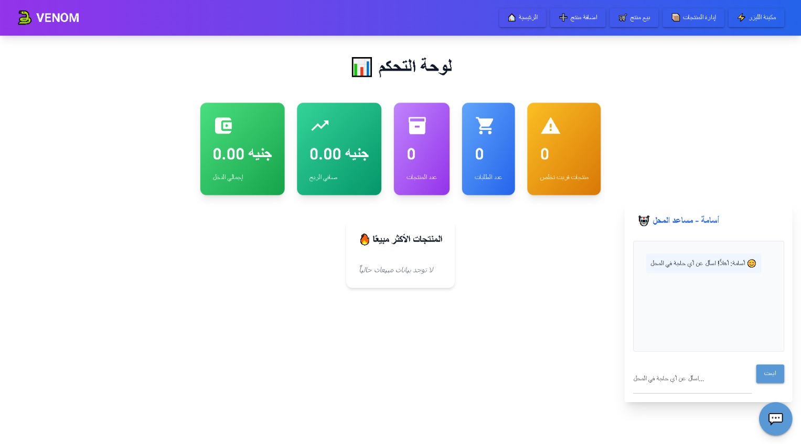

# VENOM Shop Management System

VENOM Shop is a comprehensive, locally-hosted web application designed to manage the inventory, sales, and specialized laser material operations for a small shop or business. Built with Python and the NiceGUI framework, it offers an intuitive Arabic/English interface with real-time analytics, chatbot assistance, and dedicated modules for general products and laser machine materials.



## 🌟 Features

*   **Interactive Dashboard**: Real-time analytics displaying total revenue, net profit, product count, order volume, and low-stock alerts.
*   **Product Management**:
    *   Add, edit, and delete products with purchase/sale prices and stock levels.
    *   View a sortable, searchable table of all products.
    *   Get low-stock warnings.
*   **Order Processing**:
    *   Easily create new sales orders by selecting a product and customer.
    *   View real-time pricing and profit calculations.
    *   Access a scrollable history of recent orders.
*   **Laser Material Management (Specialized Module)**:
    *   **Dedicated Tabs**: Manage materials, add new ones, process transactions (purchase, sale, return, waste), and view history.
    *   **Advanced Analytics**: Track net profit, material waste, and total purchases specific to laser operations.
    *   **Profit Margin Preview**: See profit calculations instantly when setting prices for new materials.
    *   **Comprehensive Transaction History**: Filter and review all material-related activities with detailed notes and timestamps.
*   **AI-Powered Assistance**:
    *   Integrated ChatBot for user queries (falls back to a local version if API is unavailable).
    *   Accessible via a floating button on every page.
*   **Automatic Browser Launch**: Opens the default web browser to the home page upon startup for convenience.

## 🛠️ Technologies Used

*   **Frontend & Backend Framework**: [NiceGUI](https://nicegui.io/) (Python)
*   **Database**: SQLite (via a custom `DatabaseHandler`)
*   **AI Chatbot**: Custom `ChatBot` / `LocalChatBot` classes
*   **UI Components**: Quasar Framework (integrated with NiceGUI)

## 🚀 Getting Started

### Prerequisites

*   Python 3.8 or higher
*   pip (Python package installer)

### Installation

1.  Clone this repository or download the source code.
2.  Navigate to the project directory in your terminal.
3.  Install the required dependencies. (You will need to create a `requirements.txt` file based on the imports, e.g., `nicegui`).
    ```bash
    pip install nicegui
    # Add other dependencies as needed
    ```
4.  Ensure your project structure includes the `src` directory with `database`, `ChatBot`, and `GUI` submodules as referenced in the code.

### Running the Application

1.  Make sure you are in the project's root directory.
2.  Execute the main script:
    ```bash
    python main.py
    ```
    *(Assuming the provided code is saved as `main.py`)*
3.  The application will start a local server on `http://127.0.0.1:8080` and automatically open your default web browser to the home page.

## 📂 Project Structure (Inferred)

```
venom-shop/
├── main.py                 # Main application file (this file)
├── src/
│   ├── database/
│   │   └── DatabaseHandler.py # Handles all database interactions
│   ├── ChatBot/
│   │   ├── ChatBot.py      # Primary ChatBot class (API-based)
│   │   └── LocalChatBot.py # Fallback ChatBot class
│   └── GUI/
│       └── ShopUI.py       # Class for UI components like header and chat interface
└── README.md
```

## 🤖 ChatBot Configuration

The application attempts to initialize a `ChatBot` using an API key. If the key is missing or the connection test fails, it seamlessly falls back to a `LocalChatBot`. Ensure your `ChatBot` class is configured with the necessary API credentials if you wish to use external AI services.

## 📜 License

This project is for educational and demonstration purposes. Please check the specific license for the NiceGUI framework and any other third-party libraries used.

---

**Developed with ❤️ for efficient shop management.**
